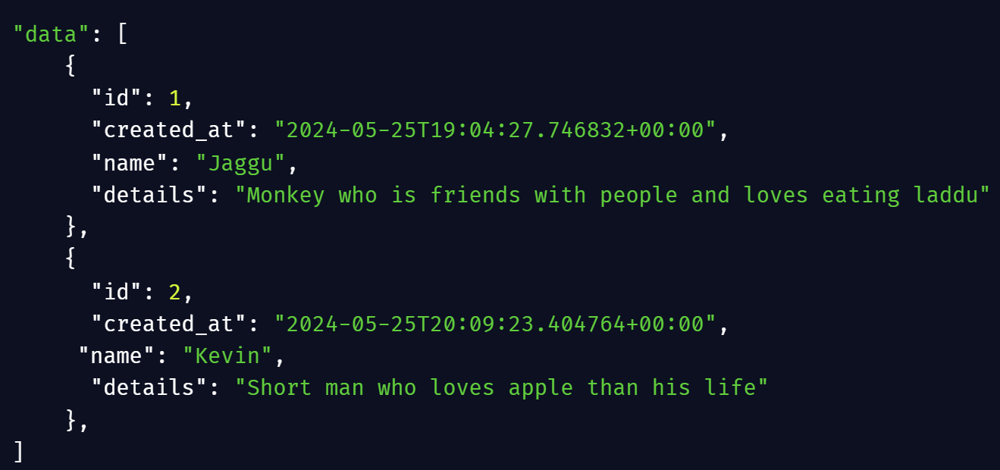
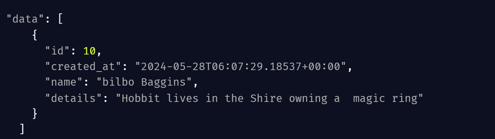
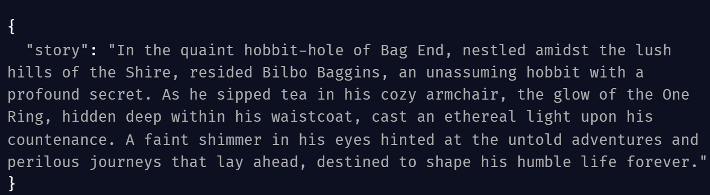

# Short Story generator

An api for creating short stories about your imaginary characters

* ✅Create a characters by name and details 
* ✅Give a character name for generating Story
* ✅Api will fetch data about the character and its details
* ✅If the character exists in DB, it will fetch the details of the character and generates a Story

## API Reference

### Get all items

```http
  GET /api/characters
```

| Parameter | Type     | Description                |
| :-------- | :------- | :------------------------- |
|  | `string` | fetches all characters |

#### response:- status 200


### Create character

```http
  Post /api/create_character
```

| Parameter | Type     | Description                       |
| :-------- | :------- | :-------------------------------- |
| `      | `string` | create character with name and details |

#### response:- status 201


### Generate story
```http
  Post /api/generate_story
```

| Parameter | Type     | Description                       |
| :-------- | :------- | :-------------------------------- |
| `      | `string` | generates story about the given character|

#### response:- status 201



## Tech Stack

* Fastapi
* Supabase
* Gemini Api

